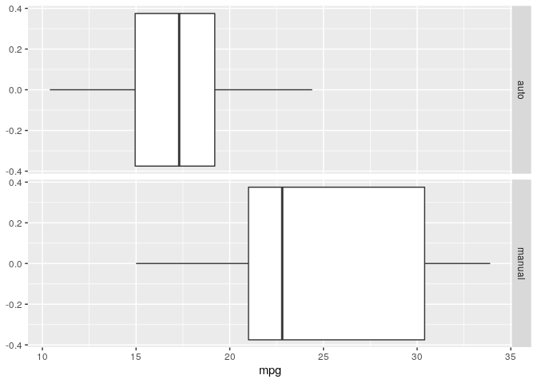
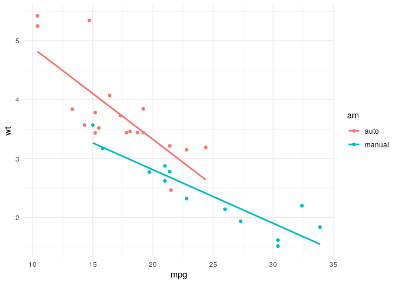

Motor Trend Analysis
================
> In this project we will use the mtcars dataset, Regression Linear Models and ANOVA and try to answer if manual vehicles do significantly more miles per gallon than automatic ones.

## Setup

``` r
require(tidyverse)
require(datasets)
require(car)
```

## EDA

``` r
df <- mtcars
```

Transmission type: column `am`:

  - 0 = automatic

  - 1 = manual

<!-- end list -->

``` r
df$am <-  as.factor(df$am)
levels(df$am) <- c("auto", "manual")

fdf <- df %>% 
    select(mpg, am)

df1 <- fdf %>% 
    group_by(am) %>% 
    summarise(
        mean = mean(mpg),
        var = var(mpg)
    )

df1
```

    ## # A tibble: 2 x 3
    ##   am      mean   var
    ##   <fct>  <dbl> <dbl>
    ## 1 auto    17.1  14.7
    ## 2 manual  24.4  38.0

``` r
ggplot(fdf, aes(x = mpg, group = factor(am))) +
    facet_grid(rows = vars(factor(am))) +
    geom_boxplot()
```

<!-- -->

**Automatic vehicles distribution mean is 7.24 mpg lesser than that of
manual vehicles.**

Let’s execute t-test to compare the means from both distributions

``` r
auto <- df[df$am == "auto",]
man <- df[df$am == "manual",]

# Null hypothesis mu_auto = mu_man
pval <- t.test(df$mpg ~ df$am, alternative = 'two.sided', conf.level = 0.95)$p.value
alpha = 0.05
pval
```

    ## [1] 0.001373638

``` r
if (pval < alpha) {
    print("Reject the null hypothesis: The means for both distributions are significantly different")
} else {
    print("Do not reject the null hypothesis")
}
```

    ## [1] "Reject the null hypothesis: The means for both distributions are significantly different"

``` r
# Features:
# Fit 0 - include all
fit <- lm(mpg ~ ., data = df)
# Fit 1 - include transmission
fit1 <- lm(mpg ~ factor(am), data = df)
print(c('Manual vehicles:',fit1$coef[1]))
```

    ##                           (Intercept) 
    ## "Manual vehicles:" "17.1473684210526"

``` r
print(c('Automatic vehicles:',fit1$coef[2]))
```

    ##                            factor(am)manual 
    ## "Automatic vehicles:"    "7.24493927125506"

Let’s check the variance inflation
    table

``` r
vif(fit)
```

    ##       cyl      disp        hp      drat        wt      qsec        vs        am 
    ## 15.373833 21.620241  9.832037  3.374620 15.164887  7.527958  4.965873  4.648487 
    ##      gear      carb 
    ##  5.357452  7.908747

Add nested models and compare in a variance table

``` r
# Fit 2 - include weight
fit2 <- lm(mpg ~ factor(am):wt, data = df)
# Fit 3 - include horsepower
fit3 <- lm(mpg ~ factor(am):wt + factor(am):hp, data = df)
# Fit 4 - include cylinders
fit4 <- lm(mpg ~ factor(am):wt + factor(am):hp +  + factor(am):cyl, data = df)

anova(fit1, fit2, fit3, fit4)
```

    ## Analysis of Variance Table
    ## 
    ## Model 1: mpg ~ factor(am)
    ## Model 2: mpg ~ factor(am):wt
    ## Model 3: mpg ~ factor(am):wt + factor(am):hp
    ## Model 4: mpg ~ factor(am):wt + factor(am):hp + +factor(am):cyl
    ##   Res.Df    RSS Df Sum of Sq       F   Pr(>F)    
    ## 1     30 720.90                                  
    ## 2     29 269.76  1    451.14 69.5596 1.09e-08 ***
    ## 3     27 191.22  2     78.54  6.0545 0.007174 ** 
    ## 4     25 162.14  2     29.08  2.2420 0.127181    
    ## ---
    ## Signif. codes:  0 '***' 0.001 '**' 0.01 '*' 0.05 '.' 0.1 ' ' 1

Adding cylinders feature reduces too little Residual Sum of Squares in
the ANOVA variance table and inflates the p-value and F-test outcome, so
we remove the cyl feature.

``` r
# Fit 5 - Remove number of cylinders, include 1/4 mile time
fit5 <- lm(mpg ~ factor(am):wt + factor(am):hp + factor(am):qsec, data = df)
summary(fit5)$coef
```

    ##                          Estimate Std. Error    t value     Pr(>|t|)
    ## (Intercept)           18.20658170 8.22189075  2.2144033 3.614486e-02
    ## factor(am)auto:wt     -2.23651011 0.91966927 -2.4318635 2.252081e-02
    ## factor(am)manual:wt   -7.93443032 1.64807771 -4.8143545 6.028012e-05
    ## factor(am)auto:hp     -0.02128378 0.01805971 -1.1785226 2.496844e-01
    ## factor(am)manual:hp    0.01316105 0.01525894  0.8625135 3.966037e-01
    ## factor(am)auto:qsec    0.59248072 0.39330262  1.5064246 1.444907e-01
    ## factor(am)manual:qsec  1.36276488 0.42535901  3.2037993 3.681525e-03

## Summary

The model explains for 90.5% of the total variance, or 88.3% of the
adjusted variance.

  - When the weight is increased by 1000 lbs, the mpg rate is `-2.24`
    for automatic and `-7.93` for manual transmission. Meaning that
    manual transmission is proven to be better for heavier vehicles.

  - Manual vehicles mpg decrease rate (slope) is less inclined. Meaning
    that lighter and less weighted vehicles do more miles per gallon.

<!-- end list -->

``` r
ggplot(df, aes(x = mpg, y = wt, group = am, color = am)) +
    geom_point() +
    geom_smooth(formula = y ~ x, method = 'lm', se = FALSE) +
    theme_minimal()
```

<!-- -->
